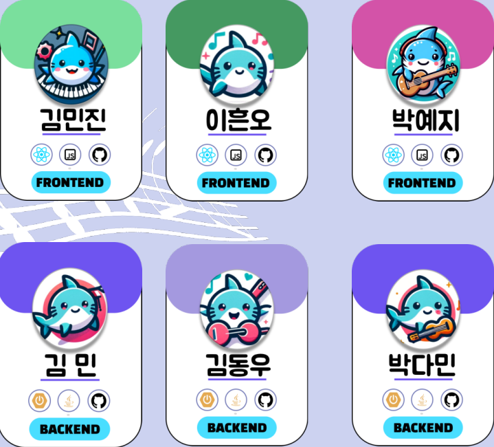

## 프로젝트명 : 악기상어(akkishark) 

### 프로젝트 소개 : 본 프로젝트는 webRTC를 활용하여 온라인 상에서 타인과 같이 악기를 연습하거나 혼자서도 연습할 수 있는 환경을 제공해주는 것을 목적으로 한다.

### 개발 환경

## 협업 툴

## IDE

## Infra

## Front-End

## Back-End

### 서비스 화면

## 채널 통화

## 개인연습 녹화

## 마이 페이지 캘린더

## 퍼펙트 플레이

## 게시판

### 주요 기능
- 소셜 로그인

- 함께 연습하기
  - 채널을 생성하여 함께 연습할 대상을 초대
  - 같은 채널 내에 참가해있는 대상들과 채팅, 화면 공유 기능으로 소통 및 연습 환경 제공
  - 채널 내 녹화 기능 제공

- 혼자 연습하기
  - Web Audio API, PITCHY를 활용하여 입력받은 오디오의 주파수를 분석하고 음높이로 수치화시켜 악기 연주 퍼펙트 플레이 게임 제공

  - 사용자의 퍼펙트 플레이 숙련도에 따른 티어 차등을 두어 성취도 제공

  - 사용자가 자신의 악기를 다루는 영상을 녹화할 수 있는 Single Record

- 마이 페이지
  - 캘린더에 사용자가 연습했던 날짜와 해당 일에 녹화한 영상을 기록
  - 유저 정보 수정
  - 작성 게시물 조회

- 커뮤니티
  - 게시글, 댓글을 작성하여 사용자들 간 소통 공간 제공

<!-- ### 기술 소개 -->
### 시스템 아키텍처

### 설계 문서

## API 설계서

## ERD 다이어그램

### 팀원 소개

